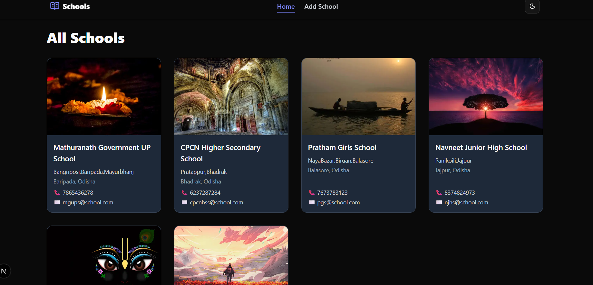
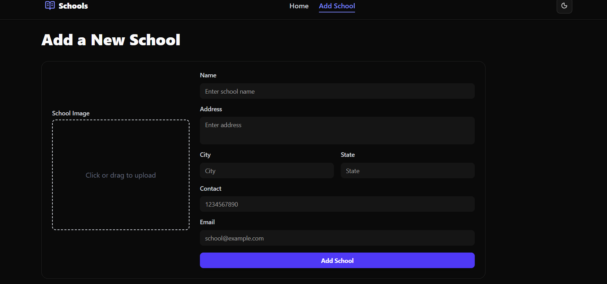
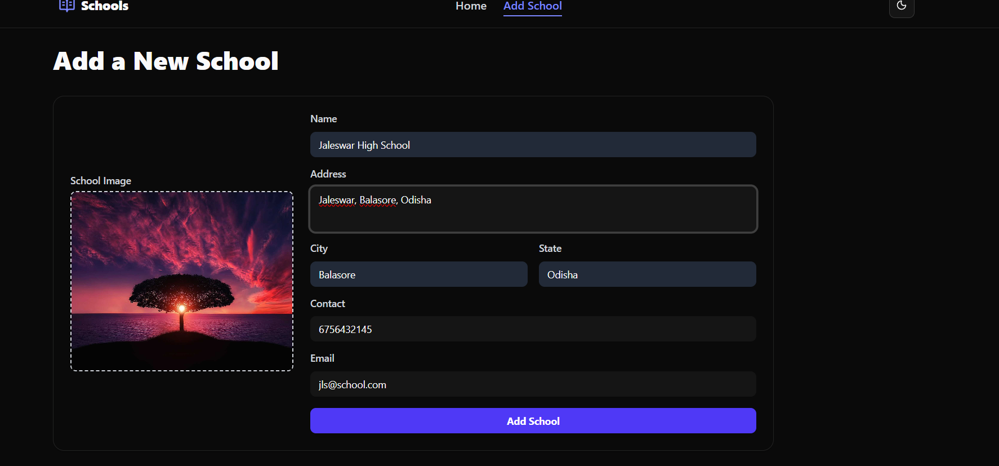

# 🏫 Schools App

A modern school management application built with **Next.js 15 (App Router)**, **Prisma**, and **Shadcn/UI**.  
It allows you to add and display schools with details such as name, address, city, state, contact, email, and image.

---

## 🚀 Features

- 📌 Add new schools with image upload (Cloudinary integration)
- 🖼️ Live image preview before upload
- 📋 Validation with **Zod** + **React Hook Form**
- 🎨 Beautiful UI with **Tailwind CSS** + **Shadcn/UI**
- 🌗 Dark mode support with theme toggler
- ⚡ Optimized images using **Next.js Image**
- 🔄 Realtime form feedback with **Sonner Toasts**
- 📂 Prisma ORM for database handling

---

## 🛠️ Tech Stack

- **Framework**: [Next.js](https://nextjs.org/) (App Router)
- **UI**: [Tailwind CSS](https://tailwindcss.com/) + [Shadcn/UI](https://ui.shadcn.com/)
- **Database**: [Prisma ORM](https://www.prisma.io/)
- **Image Hosting**: [Cloudinary](https://cloudinary.com/)
- **Validation**: [Zod](https://zod.dev/)
- **Forms**: [React Hook Form](https://react-hook-form.com/)
- **Notifications**: [Sonner](https://sonner.emilkowal.ski/)

---

## ⚙️ Installation

1. Clone the repository:

   ```bash
   git clone https://github.com/Hansadhwaja/schools.git
   cd schools
   ```

2. Install dependencies:

   ```bash
   npm install

   ```

3. Configure environment variables in .env:

   ```bash
   DATABASE_URL="your-database-url"
   CLOUDINARY_CLOUD_NAME="your-cloudinary-cloud-name"
   CLOUDINARY_API_KEY="your-api-key"
   CLOUDINARY_API_SECRET="your-api-secret"
   ```

4. Run Prisma migrations:

   ```bash
   npx prisma migrate dev
   ```

5. Start the development server:
   ```bash
   npm run dev
   ```

## Screenshots

### Homepage



### Add School Form


